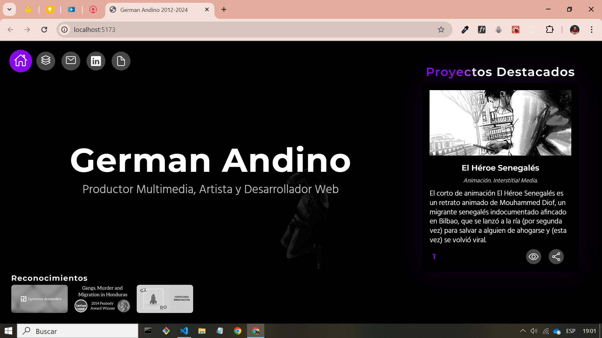

# Página de Inicio para Portafolio Personal

Este proyecto es una página dinámica e interactiva creada con React.js para mi sitio web de portafolio personal. Muestra una selección de proyectos destacados y proporciona información de contacto en un formato modular y visualmente atractivo.

## Características

- Diseño responsivo con un layout fluido
- Video de fondo para interés visual
- Elementos interactivos con efectos al pasar el mouse
- Formulario de contacto
- Sección de proyectos destacados
- Integración con LinkedIn
- Animaciones suaves utilizando react-spring

## Stack Tecnológico

- React 18.3.1
- Vite 5.4.1 (para builds y desarrollo rápidos)
- react-router-dom 6.26.2 (para enrutamiento)
- react-spring (para animaciones)
- CSS para estilos

## Estructura del Proyecto

- `LandingPage.jsx`: Componente principal para la página de inicio
- `TopBar.jsx`: Componente de navegación
- `MiddleSection.jsx`: Aloja el contenido principal, incluyendo proyectos destacados y formulario de contacto
- `BottomBar.jsx`: Componente de pie de página con navegación adicional
- `landingPageLogic.js`: Hook personalizado que contiene la lógica de ne

## Scripts

- `npm run dev`: Inicia el servidor de desarrollo
- `npm run build`: Construye el proyecto para producción
- `npm run lint`: Ejecuta ESLint para verificaciones de calidad de código
- `npm run preview`: Previsualiza la build de producción localmente

## License

[BSD 3-Clause License
Copyright (c) 2024, German Andino]

## Contact

German Andino
[andinogerman@gmail.com]

